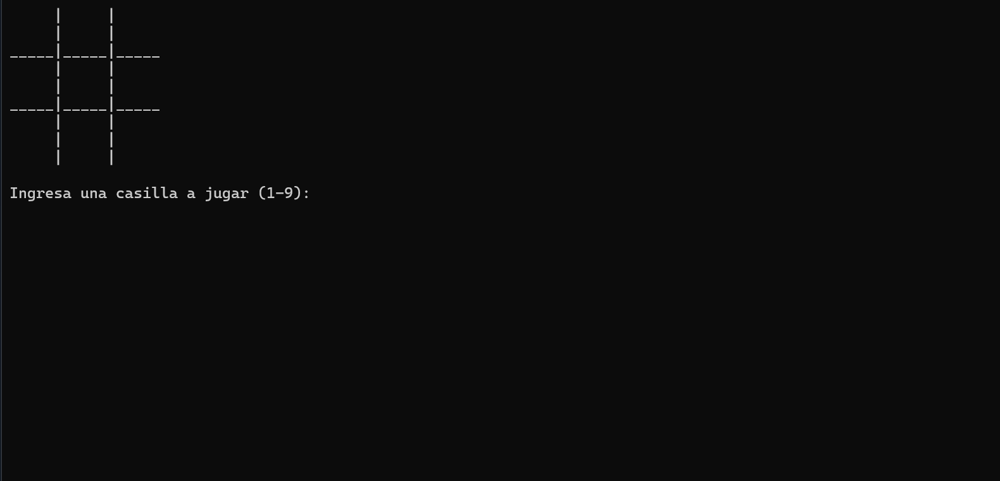
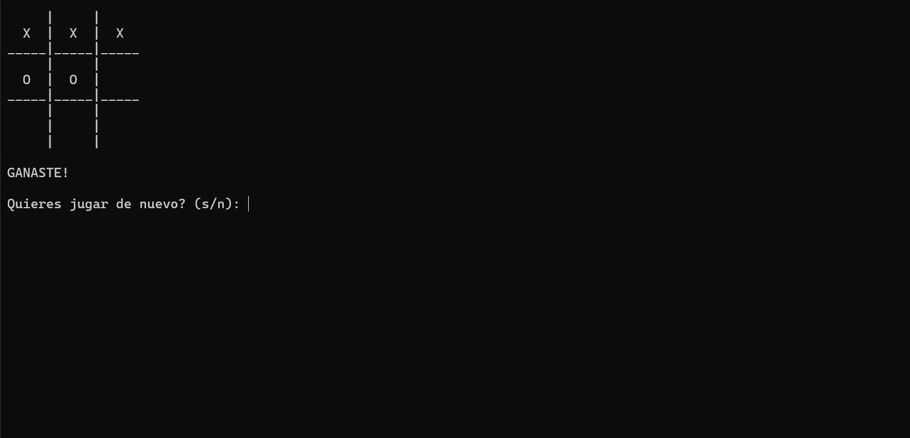
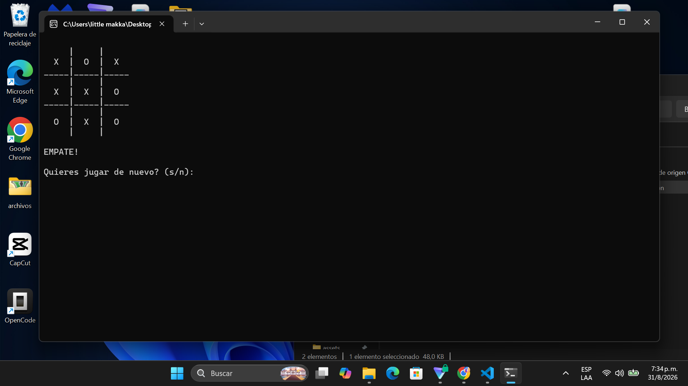
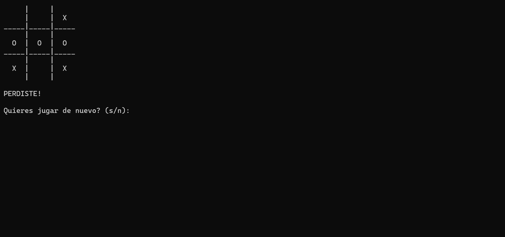

# ❌ Tic-Tac-Toe

A classic Tic Tac Toe game developed in C++ as part of my learning journey in programming. This project focuses on strengthening problem-solving skills, object-oriented programming concepts, and application logic.

---

# 📖 About the Project

Tic-Tac-Toe is a personal project created to practice C++ programming fundamentals while developing a complete console application.

The project allowed me to improve my understanding of programming logic, game rules, user interaction, and object-oriented programming concepts. It also helped me gain more confidence organizing code into a maintainable structure.

This project was developed while studying for my TSU in Informatics as part of my continuous learning process.

---

# ✨ Features

- Classic Tic Tac Toe gameplay
- Two-player mode
- Win detection
- Tie detection
- Input validation
- Simple and organized code structure
- Console-based user interface

---

# 🛠️ Technologies

### Programming Language

- C++

### Concepts

- Object-Oriented Programming
- Programming Logic
- Algorithms

### Development Tools

- Visual Studio
- GitHub

---

# 📁 Project Structure

```text
Tic-Tac-Toe/
│
├── assets/
│   ├── Home.png
│   ├── Win.png
│   ├── Lose.png
│   └── Tie.png
│
└── tictactoe.cpp
```

---

# 🚀 Installation

1. Clone the repository.

```bash
git clone https://github.com/luGa19943/Tic-Tac-Toe.git
```

2. Open the project using your preferred C++ IDE.

3. Compile the source code.

4. Run the generated executable.

---

# ▶️ Running the Project

Compile the source file using your preferred C++ compiler.

Example using g++:

```bash
g++ tictactoe.cpp -o tictactoe
```

Run the program:

```bash
./tictactoe
```

On Windows:

```bash
tictactoe.exe
```

---

# 📷 Screenshots

## 🏠 Main Menu



---

## 🏆 Win Screen



---

## 🤝 Tie Screen



---

## ❌ Lose Screen



---

# 🎯 What I Learned

Developing this project helped me strengthen my understanding of:

- C++ fundamentals
- Object-oriented programming
- Programming logic
- Conditional statements
- Loops
- Functions
- User interaction
- Problem-solving

This project also improved my confidence in designing simple applications and organizing C++ code.

---

# 🔮 Future Improvements

Some improvements I would like to implement in future versions include:

- Single-player mode with AI
- Improved console interface
- Score tracking
- Better input validation
- Graphical user interface
- Code optimization

---

# 👨‍💻 Author

**Luis García**

Junior Software Developer

- GitHub: https://github.com/luGa19943
- LinkedIn: https://www.linkedin.com/in/lgarcia-dev/
- Email: luisimi78ram32@gmail.com

---

# 📄 License

This project is licensed under the MIT License.
